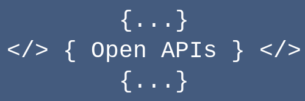

# Open APIs
A free Open APIs service that provides a variety of endpoints you can make use of in your applications.

## Introduction
Our API provides a variety of endpoints that you can use in your applications. To get started with us, select an endpoint from our documentation and follow the instructions specific to that endpoint.

## Support
If you have any questions or need assistance, feel free ask for help in **Discussions** in our GitHub repository.

## Base URL
The base URL for all of our endpoints is:
```
https://api.harys.is-a.dev/v1
```
